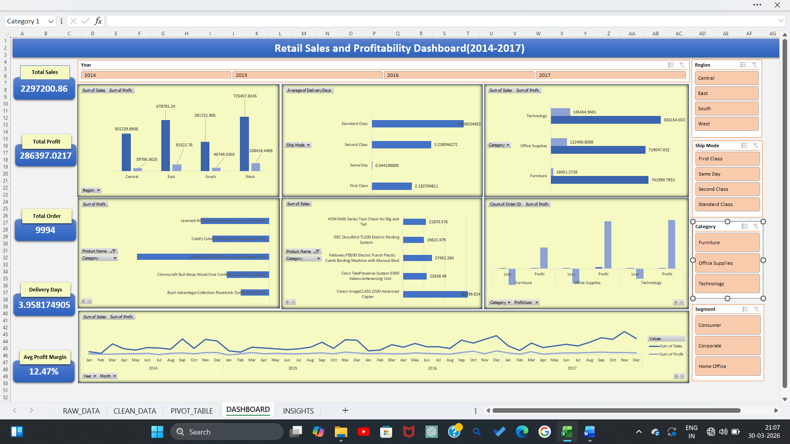
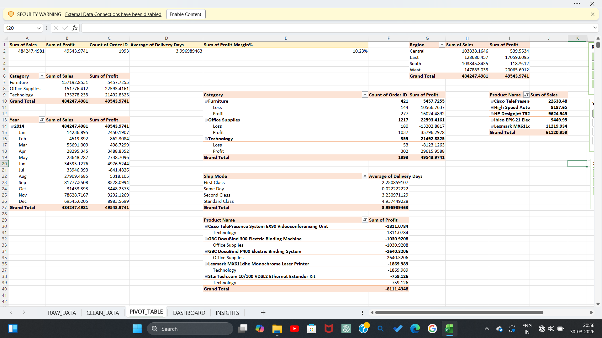
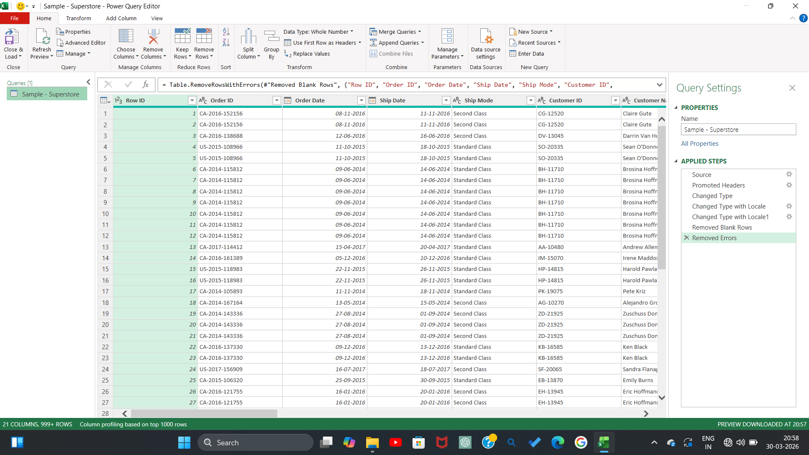

# 📊 Retail Sales & Profitability Dashboard (Excel)

## 📌 Project Overview
In this project, I worked on an end-to-end **retail sales and profitability analysis dashboard using Microsoft Excel**.

Using the **Superstore dataset**, I first cleaned and transformed the raw data using **Power Query**, then created **pivot tables for KPI calculations and trend analysis**, and finally designed an interactive dashboard to track key business metrics like **sales, profit, category performance, and regional trends**.

To make the project more business-focused, I also added a separate **insights sheet** where I summarized the major findings and profitability patterns.

This project helped me practice how Excel can be used as a complete analytics tool — from raw data cleaning to final business storytelling.

---

## 🛠 Tools & Features Used
- **Microsoft Excel**
- **Power Query**
- **Pivot Tables**
- **Pivot Charts**
- **Slicers**
- **KPI Cards**
- **Dashboard Design**
- **Business Insights Storytelling**

---

## 🔄 Project Workflow
The project was built in the following stages:

### 1️⃣ Raw Data
The original **Superstore CSV dataset** was imported into Excel.

### 2️⃣ Data Cleaning (Power Query)
I used Power Query to:
- clean missing or inconsistent values
- standardize column formats
- standardize date formats
- create derived fields where required
- prepare the dataset for reporting

### 3️⃣ Pivot Table Analysis
Pivot tables were created to analyze:
- total sales
- total profit
- category-wise performance
- region-wise sales trends
- sub-category profitability
- order trends over time

### 4️⃣ Dashboard Creation
Using pivot charts, slicers, and KPI cards, I designed an interactive dashboard to help users quickly understand:
- top-performing categories
- low-profit segments
- regional contribution
- sales vs profit relationship
- key business trends

### 5️⃣ Business Insights
A dedicated insights sheet was added to summarize:
- major profitability drivers
- loss-making categories
- high-sales but low-margin segments
- regional opportunities for growth

---

## 📈 Key Insights
Some of the major insights from the dashboard:

- Certain categories generated **high sales but lower profit margins**
- A few sub-categories were contributing to **consistent losses**
- Some regions performed strongly in sales but underperformed in profit
- Discounts had a noticeable impact on profitability
- A small number of categories drove a large share of total profit

---

## 💡 Business Recommendations
Based on the analysis, possible business actions include:

- optimize discount strategy for low-margin products
- focus marketing on high-profit categories
- review pricing for loss-making sub-categories
- improve regional inventory planning
- promote products with strong profit contribution

---

## 📂 Workbook Sheet Structure
The Excel workbook contains the following sheets:

- `RAW_DATA` → original dataset
- `CLEAN_DATA` → transformed dataset after Power Query
- `PIVOT_TABLE` → KPI summaries and calculations
- `DASHBOARD` → interactive dashboard
- `INSIGHTS` → final business findings

---

## 📷 Dashboard Preview

---

## 🎯 What I Learned
This project helped me improve my skills in:
- Excel data cleaning using Power Query
- Pivot table-based KPI analysis
- dashboard design and layout
- sales and profitability storytelling
- converting raw retail data into business insights
