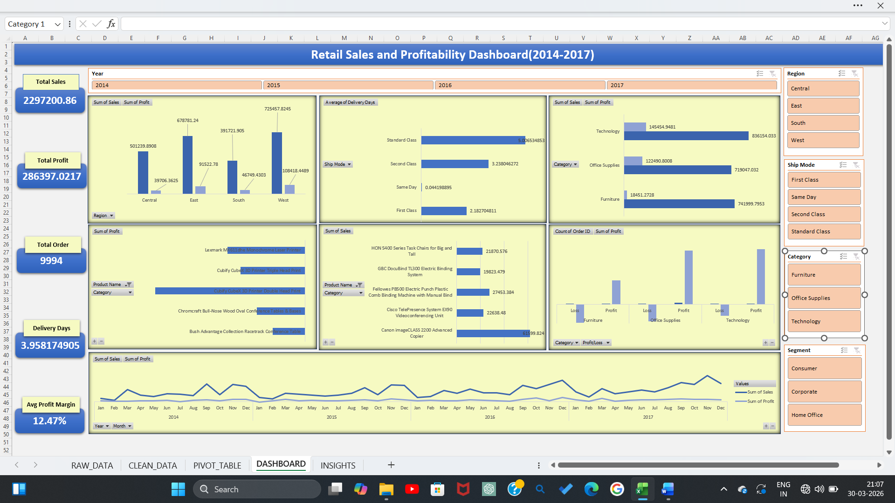
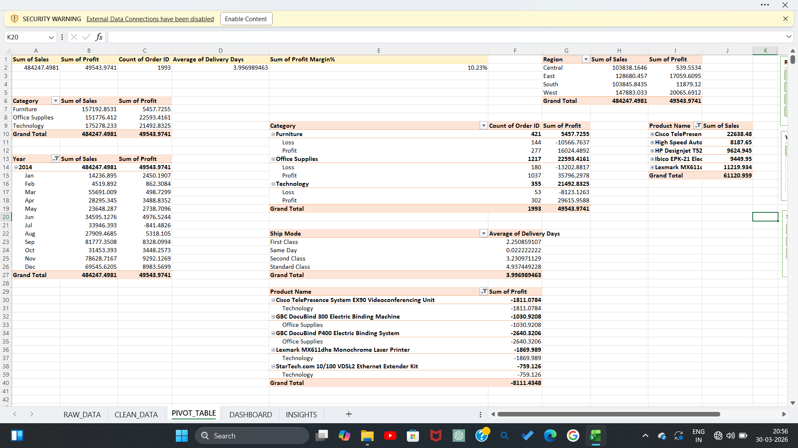
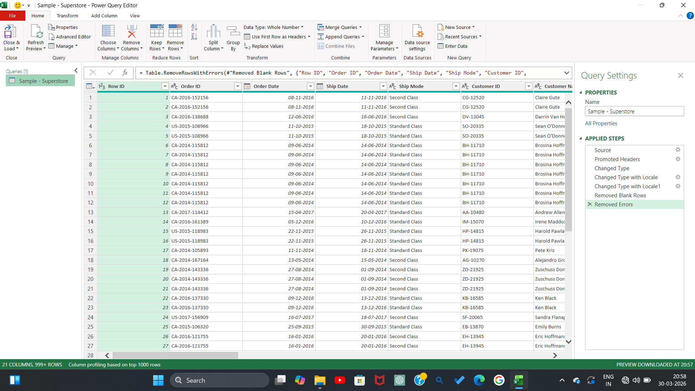

# 📊 Retail Sales & Profitability Dashboard (Excel)

End-to-end retail profitability analysis built entirely in Excel — from raw data cleaning to an interactive dashboard — on the Superstore dataset (9,994 orders, 2014–2017).

**Headline finding:** the business is profitable overall (12.5% margin) but three sub-categories are actively losing money, and the mechanism is identifiable and fixable — it's a discounting problem, not a demand problem. See [Key Insights](#-key-insights).

---

## 📌 Project Overview

This project analyzes the Superstore retail dataset to answer a specific business question: **which parts of the business generate real profit, and which parts look healthy on revenue but are quietly destroying margin?**

The workflow covers the full analytics lifecycle inside a single Excel workbook:
1. Raw data ingestion
2. Cleaning and transformation with Power Query
3. KPI and trend analysis via pivot tables
4. An interactive, filterable dashboard
5. A business insights layer translating the numbers into specific, actionable findings

---

## 🛠 Tools & Features Used
- Microsoft Excel
- Power Query (ETL)
- Pivot Tables & Pivot Charts
- Slicers (Year, Region, Ship Mode, Category, Segment)
- KPI Cards
- Dashboard Design

---

## 🔄 Project Workflow

### 1️⃣ Raw Data
The original Superstore CSV (9,994 rows, 21 fields: order/ship dates, customer, region, category, sales, discount, profit) was imported as-is.

### 2️⃣ Data Cleaning (Power Query)
- Removed inconsistent/duplicate formatting in text fields
- Standardized date fields (Order Date, Ship Date)
- Corrected data types (numeric fields, dates) for reliable aggregation
- Derived fields prepared for downstream KPI calculation (e.g., delivery days = Ship Date − Order Date)

### 3️⃣ Pivot Table Analysis
Built pivot tables covering:
- Total sales and profit by Category and Sub-Category
- Regional sales and profit trends
- Ship Mode performance
- Segment (Consumer / Corporate / Home Office) breakdown
- Order trends over time (monthly, 2014–2017)

### 4️⃣ Dashboard Creation
Interactive dashboard with KPI cards (Total Sales, Total Profit, Total Orders, Avg Delivery Days, Avg Profit Margin), pivot charts, and slicers for Year, Region, Ship Mode, Category, and Segment.

### 5️⃣ Business Insights
A dedicated INSIGHTS sheet translating the pivot data into the specific findings below.

---

## 📈 Key Insights

**Overall performance:** $2,297,201 in total sales generated $286,397 in profit — a 12.5% blended margin across 9,994 orders (5,009 unique orders).

### 1. Furniture is break-even, not just "lower margin"
| Category | Sales | Profit | Margin |
|---|---|---|---|
| Technology | $836,154 | $145,455 | **17.4%** |
| Office Supplies | $719,047 | $122,491 | **17.0%** |
| Furniture | $741,999 | $18,451 | **2.5%** |

Furniture generates almost as much revenue as the other two categories combined, but returns barely any profit. This isn't a rounding difference — it's a structurally different business.

### 2. Three sub-categories are actively losing money — and the cause is identifiable
| Sub-Category | Sales | Profit | Margin |
|---|---|---|---|
| Tables | $206,966 | **-$17,725** | **-8.6%** |
| Bookcases | $114,880 | **-$3,473** | **-3.0%** |
| Supplies | $46,674 | **-$1,189** | **-2.5%** |

Combined, these three sub-categories destroy **$22,387** in profit. Tables alone account for 79% of that loss.

**Root cause, not just a symptom:** Tables sold at a **discount above 20%** average **-$174 profit per order**. Tables sold at **full price** average **+$91 profit per order**. This is a **265-swing per order driven purely by discount depth** — the product isn't unprofitable, the discount policy on it is. Across the full dataset, discount and profit correlate at **-0.22**, and profit turns negative once discounts pass roughly the 30% mark for most categories.

### 3. A small number of sub-categories carry most of the profit
Just **3 sub-categories — Copiers, Phones, and Accessories — generate 46% of all positive profit** in the business:
| Sub-Category | Sales | Profit | Margin |
|---|---|---|---|
| Copiers | $149,528 | $55,618 | **37.2%** |
| Phones | $330,007 | $44,516 | 13.5% |
| Accessories | $167,380 | $41,937 | 25.1% |

Paper (43.4% margin) and Labels (44.4% margin) are the two highest-margin sub-categories in the entire business by percentage, though their revenue base is small.

### 4. Central region underperforms on profitability, not just volume
| Region | Sales | Profit | Margin |
|---|---|---|---|
| West | $725,458 | $108,418 | 14.9% |
| East | $678,781 | $91,523 | 13.5% |
| South | $391,722 | $46,749 | 11.9% |
| Central | $501,240 | $39,706 | **7.9%** |

Central isn't the smallest region by sales, but it has the weakest margin by a meaningful gap — worth investigating whether this is discount policy, product mix, or cost-to-serve driven.

### 5. Segment and Ship Mode show smaller, secondary effects
Home Office has the highest margin (14.0%) despite being the smallest segment by sales; Consumer is the largest by volume but lowest margin (11.5%). Ship Mode margins are fairly flat (12.1%–13.9%), suggesting shipping method is a minor profitability lever compared to discounting and category mix.

---

## 💡 Business Recommendations

1. **Cap discounts on Tables at 20% or below.** The data shows a clear, quantified profit cliff past this point — this is the single highest-leverage fix available in the dataset.
2. **Re-evaluate Furniture pricing or cost structure.** A 2.5% margin on $742K of sales suggests either COGS or discounting is misaligned with Technology/Office Supplies pricing logic.
3. **Protect and expand Copiers, Phones, and Accessories** — these three sub-categories are doing most of the profitability work; marketing and inventory priority should reflect that.
4. **Investigate Central region's cost or discount structure** specifically, rather than treating all regions as a uniform growth opportunity.
5. **Treat Bookcases and Supplies as pricing-review candidates**, not simply "underperforming" — same discount-driven mechanism as Tables likely applies, worth confirming.

---

## ⚠️ Limitations

- This analysis uses the **public Superstore sample dataset**, not proprietary company data — findings demonstrate methodology and are illustrative of the type of insight this workflow surfaces, not a live business audit.
- Profit-discount relationship is shown as a correlation and a threshold pattern (~20–30%), not a formal causal/regression estimate — a next step would be isolating discount effect from category and region via regression to control for confounding.
- Regional margin gaps (e.g., Central) are surfaced here as a finding worth investigating, not a root-caused conclusion — cost-to-serve and product-mix data would be needed to confirm the driver.

---

## 📂 Workbook Sheet Structure
- `RAW_DATA` → original dataset
- `CLEAN_DATA` → transformed dataset after Power Query
- `PIVOT_TABLE` → KPI summaries and calculations
- `DASHBOARD` → interactive dashboard
- `INSIGHTS` → business findings above

---

## 📷 Dashboard Preview

---

## 🎯 Skills Demonstrated
- Power Query–based data cleaning and ETL
- Pivot table-driven KPI construction
- Root-cause identification from aggregate data (not just reporting the aggregate)
- Translating a correlation into a specific, actionable pricing threshold
- Dashboard design for non-technical stakeholders
